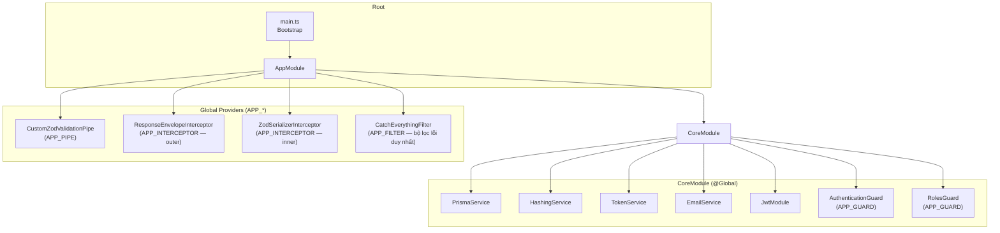
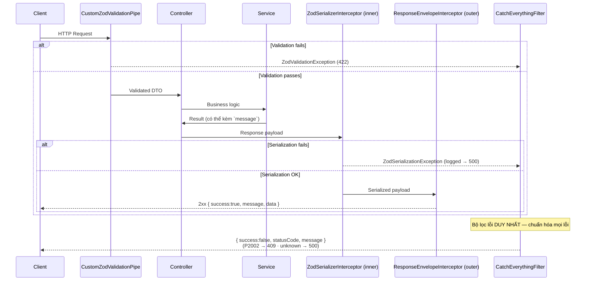
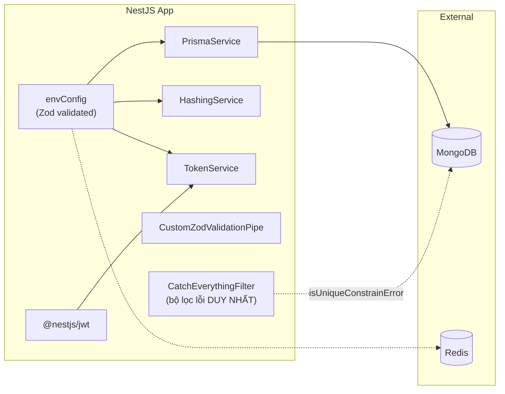

# 🏗️ Kiến trúc hệ thống — Mangaka Backend

> Tài liệu mô tả kiến trúc tổng thể, data flow, và các design pattern được áp dụng trong dự án.
> **Đọc file này TRƯỚC khi bắt tay vào code.**

> **System architecture diagram tổng:** Xem bộ 11 diagram (C4 × 4 + ER + Sequence × 5) tại [`../Architecture-Diagrams/README.md`](../Architecture-Diagrams/README.md). File master: `mangaka-architecture.drawio`. Mở nhanh gallery: `../Architecture-Diagrams/exports/gallery.html`.

---

## 1. Tech Stack Overview

| Layer | Công nghệ | Version | Ghi chú |
|-------|-----------|---------|---------|
| **Runtime** | Node.js | 22+ | LTS, chạy trên ES2022 target |
| **Framework** | NestJS | 11.x | Sử dụng module pattern, Dependency Injection |
| **Language** | TypeScript | 5.7+ | Strict mode, `NodeNext` module system |
| **ORM** | Prisma | 6.19+ | Schema-first, type-safe database access |
| **Database** | MongoDB | 7.x | Replica set (`rs0`) bắt buộc cho Prisma |
| **Cache/Queue** | Redis + BullMQ | Redis 7.x / BullMQ 5.x | Rate-limit, distributed cron locks, and job queues |
| **Validation** | Zod + nestjs-zod | zod 4.x | Schema validation cho cả request và response |
| **Auth** | JWT (HS256) | @nestjs/jwt 11.x | Access + Refresh token pair |
| **Hashing** | bcrypt | 6.x | Password hashing |
| **API Docs** | Swagger | @nestjs/swagger 11.x | Auto-generated tại `/api` |
| **Package Manager** | pnpm | 10+ | Workspace-aware, lockfile `pnpm-lock.yaml` |
| **Container** | Docker | Multi-stage build | Production (`Dockerfile`) + Dev all-in-one (`Dockerfile.dev`) |
| **CI** | GitHub Actions | - | Build verification trên `main` và `develop` |
| **Linting** | ESLint + Prettier | Flat config (`eslint.config.mjs`) | No semicolons, single quotes, 120 printWidth |

---

## 2. Cấu trúc thư mục

```
BE-dev/
├── prisma/
│   └── schema.prisma              # Database schema (MongoDB)
├── ai-service/                    # Python FastAPI AI segmentation service (optional profile ai)
├── src/
│   ├── main.ts                     # Bootstrap — khởi tạo app, Swagger, listen port
│   ├── app.module.ts               # Root module — import CoreModule + feature modules, đăng ký global pipes/filters/interceptor
│   ├── initialScript/              # Seed script (admin, roles) — chạy bằng `pnpm seed`
│   ├── modules/                    # ⭐ Feature modules (vertical slice) — BE-A
│   │   ├── auth/                   # đăng ký, OTP, login/refresh, đổi/quên mật khẩu
│   │   ├── users/                  # admin tạo user, hồ sơ Mangaka/Assistant
│   │   ├── notification/           # NotificationService (@Global) + đọc thông báo
│   │   ├── reviews/                # ASSISTANTREVIEW/MANGAKAREVIEW + reputation
│   │   ├── series/                 # proposal, Name, pitch, series state (controller + name.controller)
│   │   ├── chapter/                # Chapter/Schedule/Manuscript/Page + publish
│   │   ├── annotation/             # markup review (shared Mangaka↔Assistant, Editor↔Mangaka)
│   │   ├── storage/                # signed URL (presign PUT/GET) wiring
│   │   ├── ai/                     # Spec 2 AI segmentation jobs, queue, proposal-first apply
│   │   ├── audit/                  # PA-06 AuditLog (@Global) dual-write best-effort + GET /audit
│   │   ├── app-config/             # PA-10 registry tham số nghiệp vụ (@Global) + GET/PATCH /admin/app-config
│   │   ├── contract/               # ⚠️ BE-B (B1 Contract/Payment) — đã bắt đầu trong repo, KHÔNG thuộc BE-A
│   │   └── board/                  # ⚠️ BE-B (B5 Board/Decision engine) — đã bắt đầu trong repo, KHÔNG thuộc BE-A
│   │       # mỗi module: controller(s) + service (orchestrator) + services/ (use-case + state)
│   │       #            + repo + mapper? + messages? + constant? + ports? + schemas + dto + errors
│   │       # <name>.messages.ts: catalog text user-facing (response/notification/error) — string thuần,
│   │       #            errors/<name>.errors.ts tham chiếu sang (xem AGENTS §7)
│   ├── core/                       # App-level cross-cutting rules, @Global()
│   │   ├── core.module.ts          # Export infra services + register global guards
│   │   ├── config/envConfig.ts     # Zod fail-fast env
│   │   ├── events/                 # DomainEventBus + domain-events.ts (contract BE-A/BE-B)
│   │   ├── http/                   # decorators/ · docs/ · dto/ · filters/ · interceptors/ · pipes/
│   │   │   ├── decorators/         # @ApiErrors(...exceptions) derive status+code+hint cho Swagger
│   │   │   ├── docs/               # ENUM_DOCS + ERROR_HINTS + zEnum/zRole/zRoleSubset
│   │   │   ├── dto/                # MessageResDto, EmptyBodyDto
│   │   │   ├── filters/
│   │   │   ├── interceptors/
│   │   │   ├── pipes/
│   │   │   └── http.messages.ts
│   │   ├── security/               # constants/ · decorators/ · errors/ · guards/ · services/
│   │   │   ├── constants/          # role/auth type/rate-limit constants
│   │   │   ├── decorators/
│   │   │   ├── errors/
│   │   │   ├── guards/
│   │   │   ├── services/
│   │   │   └── security.messages.ts
│   │   └── models/user.model.ts    # User schema + Prisma-sourced UserStatus
│   ├── infrastructure/             # External adapters / technology details
│   │   ├── database/               # PrismaService + Prisma error helpers
│   │   ├── crypto/                 # HashingService (bcrypt)
│   │   ├── token/                  # TokenService + JWT payload types
│   │   ├── email/                  # EmailService (Resend) + queue/processor + React-email templates
│   │   ├── queue/                  # BullMQ queue config + QueueService
│   │   ├── redis/                  # ioredis clients + RedisService helpers
│   │   ├── oauth/                  # GoogleTokenVerifierService (verify Google ID token — A-AUTH-GGL)
│   │   └── storage/                # StorageService (Cloudflare R2 presigned URL)
├── test/                           # E2E tests (Jest)
├── scripts/                        # Smoke/dev script local — GITIGNORED (không commit, không build)
├── .env                            # Env variables (KHÔNG commit lên git)
├── .env.example                    # Template env (đầy đủ biến bắt buộc)
├── Dockerfile                      # Production multi-stage build (→ node dist/main.js)
├── docker-compose.prod.yml         # Compose VPS: redis + api + caddy (+ ai-service profile `ai`)
├── .github/workflows/ci.yml        # CI: build Docker image verification
├── .github/workflows/deploy.yml    # CD: deploy VPS
├── package.json                    # Dependencies + scripts
├── pnpm-lock.yaml                  # Lockfile
├── pnpm-workspace.yaml             # pnpm build allowlist (native modules)
├── tsconfig.json                   # TS config — strict, NodeNext modules
├── tsconfig.build.json             # Build config — rootDir src, exclude scripts/test/specs
├── eslint.config.mjs               # ESLint flat config
└── .prettierrc                     # Code formatting rules

# Local dev Docker (docker-compose.yml, Dockerfile.dev, docker-entrypoint.dev.sh) ĐÃ GỠ — chạy BE bằng Node/pnpm.
```

---

## 3. Module Architecture



### CoreModule là `@Global()`
- Tất cả services exported (PrismaService, HashingService, TokenService, EmailService) đều **tự động available** ở mọi module khác mà KHÔNG cần import lại.
- Khi tạo module mới, chỉ cần inject service qua constructor là dùng được.
- `CoreModule` registers `AuthenticationGuard` as the first global guard (`APP_GUARD`): routes require Bearer auth by default unless marked with `@IsPublic()`.
- `RolesGuard` is registered as the second global guard, after `AuthenticationGuard`, so it can read `request.user` and enforce `@Roles(...)`.
- Core/infrastructure-vs-module rule: `core/` contains app-level cross-cutting rules, `infrastructure/` contains external adapters, and domain logic belongs in `modules/<domain>/` (for example `OtpPurpose` and OTP generation live in `modules/auth/`).

### RBAC (Authorization)

- Routes without `@Roles()` behave as authenticated routes without role restriction.
- Routes with `@Roles(RoleName.SUPER_ADMIN, ...)` require the access-token `roleName` to be in the allowed list; missing user or wrong role returns 403. (Role codes: `MANGAKA`, `ASSISTANT`, `EDITOR`, `BOARD_MEMBER`, `SUPER_ADMIN` — **không có** `ADMIN`.)
- The current authorization tier is role-based. Permission-based authorization can be added later when granular business rules require it.

---

## 4. Request Lifecycle & Error Handling



### Chi tiết Error & Response Flow

| Tầng | Loại | Hành vi |
|------|------|---------|
| `CustomZodValidationPipe` | Request validation | Sai → **422**, ném `ZodValidationException` (mảng `{message, path}`) |
| `ZodSerializerInterceptor` (inner) | Response serialize theo DTO | Lỗi → `ZodSerializationException` → 500 (được log ở filter) |
| `ResponseEnvelopeInterceptor` (outer) | Bọc response thành công | `{ success:true, message, data }` (xem §4.1) |
| `CatchEverythingFilter` | **Bộ lọc lỗi duy nhất** | `{ success:false, statusCode, message, errors?, code?, retryAfter? }`; P2002 → **409**; unknown → **500** + log |

> ⚠️ **Quan trọng**: Validation errors trả về **422** (KHÔNG phải 400) — design decision để client phân biệt validation error vs bad request.

### 4.1. Response Envelope (chuẩn hóa toàn hệ thống)

Mọi response **thành công** được `ResponseEnvelopeInterceptor` bọc:

```jsonc
{ "success": true, "message": "Success", "data": { /* payload */ } }
```

- Nếu service trả object có field `message` (string) → `message` nâng lên top-level, phần còn lại là `data`
  (`null` nếu không còn field). Ngược lại → `message: "Success"`, `data` = payload nguyên vẹn.
- Interceptor đăng ký **TRƯỚC** `ZodSerializerInterceptor` ⇒ trên response path, Zod serialize trước, envelope bọc sau.
  ⚠️ Hệ quả: `message` tuỳ biến chỉ "sống" nếu DTO `@ZodResponse` **có khai field `message`** (vd `MessageResDto`);
  Zod serialize trước sẽ **strip** mọi field ngoài DTO → trả `{ message }` với DTO `{ id }` sẽ mất message (rơi về `"Success"`).
- ⚠️ Swagger DTO mô tả shape *chưa bọc*; response thật luôn bọc envelope → **FE đọc `data`**.

Mọi response **lỗi** (từ `CatchEverythingFilter`):

```jsonc
// lỗi field-level (validation / có path): message string + errors[]
{ "success": false, "statusCode": 422, "message": "Invalid email address",
  "errors": [ { "message": "Invalid email address", "path": "email" } ] }

// lỗi đơn / hệ thống: chỉ message string, KHÔNG có errors
{ "success": false, "statusCode": 403, "message": "Error.EmailNotVerified" }

// rate-limit (OTP) keeps retry metadata for FE cooldown UI
{ "success": false, "statusCode": 429, "message": "Error.OtpRateLimited",
  "code": "AUTH_OTP_RATE_LIMITED", "retryAfter": 60 }
```

- `message` **LUÔN là string** (hiển thị). Field-level issues đặt ở **`errors[]`** (`{message,path}`); nhiều issue →
  `message: "Validation failed"`. KHÔNG còn object lồng object / message-trong-message như bản cũ.
- Text của message lấy từ **`<name>.messages.ts`** (catalog tập trung), errors file chỉ map status + path (xem AGENTS §7).

### 4.2. API Documentation (Swagger) — `/api`

Swagger doc auto-sinh từ Zod schema (`createZodDto` + nestjs-zod v5 → `z.toJSONSchema` cho zod4). Convention (chi tiết AGENTS §12):

- **Envelope note toàn cục:** `main.ts` `DocumentBuilder.setDescription` giải thích 1 lần shape `{success,message,data}` + lỗi.
  Example Value của từng API mô tả shape **CHƯA bọc** (chính là `data`) → FE đọc `res.data`.
- **Field metadata:** enum dùng `zEnum(PrismaEnum, 'Key')` / `zRole()` từ `core/http/docs/enum-docs.ts` để hiện giá trị + mô tả thống nhất; field khó hiểu thêm `.describe(...)`.
- **Per-route:** `@ApiOperation({ summary })` + `@ApiErrors(...exceptions)` cho các mã lỗi nghiệp vụ; decorator derive status/code/hint từ exception instance + `ERROR_HINTS`.
- **Catalog dùng chung (`core/http/`):** `enum-docs.ts` (`zEnum`/`zRole` + `ENUM_DOCS`), `error-docs.ts` (`ERROR_HINTS`), `api-errors.decorator.ts` (`@ApiErrors`). Sửa enum/lỗi → sửa 1 nơi.
- `message` tuỳ biến chỉ "sống" nếu DTO `@ZodResponse` có field `message` (Zod serialize trước, strip field ngoài DTO — xem §4.1 + AGENTS §10).

---

## 5. Env Configuration — Fail-Fast Strategy

File `envConfig.ts` sử dụng Zod để validate toàn bộ biến môi trường **ngay khi app khởi động**:

```typescript
// Nếu thiếu hoặc sai kiểu bất kỳ env var nào → process.exit(1) ngay lập tức
const configSchema = z.object({
  PORT: z.coerce.number(),
  SALT_OR_ROUNDS: z.coerce.number(),
  DATABASE_URL: z.string(),
  ACCESS_TOKEN_SECRET: z.string(),
  REFRESH_TOKEN_SECRET: z.string(),
  // ... tất cả các biến bắt buộc
})
```

### Danh sách env variables

| Variable | Type | Mô tả |
|----------|------|--------|
| `PORT` | number | Port server listen |
| `SALT_OR_ROUNDS` | number | bcrypt salt rounds |
| `DATABASE_URL` | string | MongoDB connection string (cần replica set) |
| `REDIS_URL` | string | Redis connection string |
| `ACCESS_TOKEN_SECRET` | string | Secret key cho access JWT |
| `REFRESH_TOKEN_SECRET` | string | Secret key cho refresh JWT |
| `ACCESS_TOKEN_EXPIRES_IN` | string | TTL access token (vd: `1h`) |
| `REFRESH_TOKEN_EXPIRES_IN` | string | TTL refresh token (vd: `7d`) |
| `API_KEY` | string | API key cho internal services |
| `AUTH_TYPE_KEY` | string | Header key chỉ định loại auth (default: `authType`) |
| `NAME_APP` | string | Tên app (email template, ...) |
| `ADMIN_NAME` / `ADMIN_PASSWORD` / `ADMIN_EMAIL` / `ADMIN_PHONE` | string | Seed Super Admin |
| `OTP_EXPIRES_IN` | string | TTL mã OTP (vd: `5m`) |
| `OTP_RL_EMAIL_MAX` / `OTP_RL_EMAIL_WINDOW` | number | OTP quota theo email trong cửa sổ giây |
| `OTP_RL_IP_MAX` / `OTP_RL_IP_WINDOW` | number | OTP quota theo IP trong cửa sổ giây |
| `OTP_RL_COOLDOWN` | number | Cooldown giây giữa các lần xin OTP |
| `DEADLINE_WARN_THRESHOLD_HOURS` | number | Cron cảnh báo chapter gần deadline trong N giờ tới |
| `ORPHAN_ASSET_TTL_HOURS` | number | TTL trước khi cleanup asset record chưa thấy object trên R2 |
| `TRUST_PROXY_HOPS` | number | Express trust proxy hops để lấy đúng client IP cho rate-limit |
| `RESEND_API_KEY` | string | API key gửi email OTP/credential (Resend) |
| `EMAIL_FROM` / `EMAIL_LOGO_URL` | string | Sender email (có default) + logo URL trong email (rỗng → text fallback) |
| `GOOGLE_CLIENT_ID` | string | Google OAuth client id (verify Google ID token — login Google) |
| `R2_ENDPOINT` / `R2_ACCESS_KEY_ID` / `R2_SECRET_ACCESS_KEY` / `R2_BUCKET` / `R2_REGION` | string | Cloudflare R2 (object storage, presigned URL). **`R2_ENDPOINT` bắt buộc, không default** |
| `DEADLINE_SLOT_GRACE_HOURS` | number | Ngưỡng auto đánh giá `affectsSlot` cho DeadlineRequest (A5, default 48) |
| `AI_SERVICE_URL` | string | Base URL AI service (Spec 2). **Rỗng = AI TẮT** (segment fallback manual) |
| `AI_SERVICE_API_KEY` | string | Shared secret khớp `API_KEY` của ai-service. **Bắt buộc nếu `AI_SERVICE_URL` được set** (nếu không → fail-fast) |
| `AI_HTTP_TIMEOUT_MS` | number | Timeout gọi AI service (default 120000) |

> **Lưu ý**: Khi chạy production (`NODE_ENV=production`), không cần file `.env` vật lý — env vars được inject từ orchestrator. Thiếu bất kỳ biến bắt buộc nào → `process.exit(1)` lúc boot (fail-fast). Danh sách nguồn sự thật: `src/core/config/envConfig.ts`.
> `REDIS_URL` hiện là hạ tầng bắt buộc lúc boot: `RedisService` ping fail-fast; BullMQ, OTP rate-limit, và cron locks dùng chung Redis.
> **AI service** là process Python riêng (`ai-service/`) — xem `ai-service/README.md` để chạy + lấy model.

---

## 6. Database Layer

### Prisma + MongoDB

- **Provider**: `mongodb`
- **Schema location**: `prisma/schema.prisma`
- **ID strategy**: `@default(auto()) @map("_id") @db.ObjectId` — sử dụng ObjectId gốc của MongoDB
- **Replica Set**: Bắt buộc (`rs0`) — Prisma yêu cầu transactions/change streams

### Models

Schema (`prisma/schema.prisma`) khai báo **toàn bộ domain Mangaka** (~39 models) từ đầu. BE-A đã hiện thực 10 module (auth, users, notification, reviews, series, chapter, annotation, storage, studio, task); BE-B đã bắt đầu module `contract` + `board`. Nhóm models theo bounded context:

| Nhóm | Models |
|------|--------|
| **Identity & Access** | `User`, `Role`, `RefreshToken`, `OtpRequest` |
| **Content & Production** | `Series`, `SeriesProposal`, `Name`, `NamePage`, `Chapter`, `Page`, `Region`, `Manuscript`, `Asset`, `TaskAsset` |
| **Tasks & Review** | `Task`, `TaskVersion`, `Annotation`, `Schedule`, `ScheduleExtension` |
| **Survey & Ranking** | `SurveyPeriod`, `SurveyData`, `SurveyEntry`, `ReaderVote`, `ReaderVoteSeries`, `RankingRecord` |
| **Board & Decisions** | `BoardDecision`, `Vote`, `SeriesReport`, `ReportAttachment` |
| **Reputation (A-AUTH-07)** | `MangakaProfile`, `AssistantProfile` (reputationScore/ratingAvg/...), `AssistantReview`, `MangakaReview` |
| **Notification & Config** | `Notification`, `VotingConfig`, `BoardConfig` |

> **Deprecated:** `PaymentConfig`, `EarningRecord` — hệ thống không quản lý lương Assistant (BR-ASSIST-02); thu nhập Mangaka chuyển sang Contract/PaymentCondition/PaymentRecord (BE-B, Flow 6).

**Enum**: ngoài `UserStatus`/`OtpPurpose` (auth), các state machine đã code đều dùng Prisma enum +
embedded `statusHistory[]` cho audit, single-writer qua state service: `SeriesStatus`/`ProposalStatus`/`NameStatus` (A2),
`ManuscriptStatus`/`PageStatus`/`ChapterStatus`/`AnnotationType` (A3). State machine của BE-B (Contract/Board/...) sẽ thêm dần.

```prisma
model User {
  id            String     @id @default(auto()) @map("_id") @db.ObjectId
  email         String     @unique
  name          String
  displayName   String?
  password      String
  phoneNumber   String
  avatar        String?
  roleId        String     @db.ObjectId
  status        UserStatus @default(INACTIVE)
  emailVerified Boolean    @default(false)
  createdAt     DateTime   @default(now())
  updatedAt     DateTime   @updatedAt
  deletedAt     DateTime?

  role          Role           @relation(fields: [roleId], references: [id])
  refreshTokens RefreshToken[]

  @@index([deletedAt])
}
```

### PrismaService Lifecycle

```
App Start → onModuleInit() → $connect()
App Stop  → onModuleDestroy() → $disconnect()
```

### Prisma Error Helpers

| Function | Prisma Code | Ý nghĩa |
|----------|-------------|---------|
| `isUniqueConstrainError()` | P2002 | Duplicate key / unique constraint violation |
| `isNotFoundError()` | P2025 | Record not found |

---

## 7. Authentication Architecture

### JWT Token Pair

```
┌─────────────────────────────────────────────────┐
│ TokenService                                     │
├─────────────────────────────────────────────────┤
│ signAccessToken(userId)  → JWT (HS256, 1h TTL)  │
│ signRefreshToken(userId) → JWT (HS256, 7d TTL)  │
│ verifyAccessToken(token) → JwtPayload           │
│ verifyRefreshToken(token)→ JwtPayload           │
└─────────────────────────────────────────────────┘
```

### JWT Payload Interfaces

Access token carries `roleName` for RBAC checks; refresh token carries only `userId`.

```typescript
interface JwtAccessTokenPayload {
  userId: string   // ID người dùng (Mongo ObjectId dạng string)
  roleName: string // Role code — dùng cho phân quyền
  exp: number      // Expiration timestamp
  iat: number      // Issued at timestamp
}

interface JwtRefreshTokenPayload {
  userId: string
  exp: number
  iat: number
}
```

### HashingService

- `hash(value)` — bcrypt hash với salt rounds từ env
- `compare(value, hash)` — so sánh plaintext với hash

---

## 7.5. Cross-cutting Services (Sprint 0)

### Domain Events — `src/core/events/`
- In-process event bus (`@nestjs/event-emitter`). Contract dùng chung BE-A/BE-B trong `domain-events.ts`.
- Emit: `domainEventBus.emit(DomainEvent.X, payload)` · Listen: `@OnEvent(DomainEvent.X)`.
- **Emit SAU khi DB write commit** (không trong transaction).

| Const | Event | Emitter | Consumer |
|-------|-------|---------|----------|
| `SeriesSerialized` | `series.serialized` | A2 | B1 |
| `ChapterPublished` | `chapter.published` | A-CHP-05 | B-CON-05, B4 |
| `ContractExecuted` | `contract.executed` | B1 | A2, A-CHP-05 |
| `RankingFinalized` | `ranking.finalized` | B4 | B-CON-05, B5 |
| `SeriesCancelling` / `SeriesCancelled` | `series.cancelling` / `series.cancelled` | B5 | B-CON-09 / A·B |

### Async Infrastructure — Redis, BullMQ, Schedule

- `RedisModule` (`@Global`) cung cấp 2 client ioredis: client general cho lock/rate-limit và client BullMQ cho queue workers.
- `QueueModule` (`@Global`) cấu hình BullMQ với retry/backoff mặc định. Queue hiện có: `email`, `notification`.
- Email side-effect (OTP, admin credentials) đi qua `EmailQueue`; nếu enqueue lỗi thì fallback gửi sync best-effort và log, không phá flow nghiệp vụ đã ghi DB.
- Notification side-effect đi qua `NotificationQueue`; processor gọi `NotificationService.notify(...)` để giữ idempotency theo recipient/type/reference.
- `ScheduleModule.forRoot()` bật cron nền:
  - deadline warning hourly: lock Redis `cron:deadline-warning`, notify Mangaka/Editor cho chapter chưa publish gần deadline.
  - orphan asset cleanup daily: lock Redis `cron:orphan-asset`, xóa DB asset record stale khi object không tồn tại trên R2.

### Notification — `NotificationService` (`@Global`)
`notify({ recipientId, type, referenceId?, referenceType?, content? })` — idempotent theo
(recipient + type + ref). Inject thẳng ở bất kỳ module nào.

### Storage — `StorageService` (`@Global`, R2)
Presigned URL: BE **không ôm bytes**, chỉ cấp signed PUT/GET có hạn + validate type/size (ngưỡng = `AppConfig.maxUploadBytes`,
default 15MB) + RBAC; DB lưu **object key**. S3Client tắt CRC32 mặc định + pin content-type vào chữ ký (xem gotcha `AGENTS.md` §10).

### Audit — `AuditService` (`@Global`, PA-06)

`record({ actorId, entityType, entityId, action, fromState?, toState?, reason? })` — **dual-write** (GIỮ `statusHistory[]`
embedded + THÊM collection `AuditLog` tập trung + `GET /audit` cho SUPER_ADMIN/BOARD_MEMBER). **Best-effort** (nuốt lỗi,
KHÔNG throw — mirror `notifySafe`); gọi SAU commit, NGOÀI transaction. Cắm ở 10 điểm state-transition/moderation/config BE-A.

### AppConfig — `AppConfigService` (`@Global`, PA-10)

`get()` trả registry 7 tham số nghiệp vụ (cache in-memory TTL 30s + lazy-seed + invalidate-on-PATCH). `GET/PATCH /admin/app-config`
(SUPER_ADMIN). Wire BE-A: `nameMaxReviewRounds`/`maxUploadBytes`/`reputationRecommendThreshold`; env/constant cũ = **seed default**.

### State Machine (single-writer)
Mỗi state machine chỉ ghi bởi 1 `<entity>-state.service.ts`: validate transition theo `*_TRANSITIONS` (sai → 409) +
push `statusHistory[]` (audit) + đồng bộ status dẫn xuất. Cross-module chưa sẵn sàng → khai **port interface** +
marker `// B1/B3/B5-INTEGRATION` (KHÔNG stub).

---

## 8. Docker Architecture

> **Local dev Docker đã bị gỡ** (`docker-compose.yml`, `Dockerfile.dev`, `docker-entrypoint.dev.sh` không còn).
> BE chạy local trực tiếp bằng Node/pnpm + MongoDB + Redis (xem `README.md`). Docker chỉ còn cho CI + deploy VPS.

### Production (`Dockerfile`)

```
Multi-stage build:
  Stage 1 (base)      → Node 22-slim + openssl + ca-certificates + pnpm
  Stage 2 (build)     → pnpm install --frozen-lockfile → prisma generate → pnpm build (dist/)
  Stage 3 (prod-deps) → pnpm install --frozen-lockfile --prod → prisma generate
  Stage 4 (runtime)   → copy dist + node_modules + prisma → non-root user → CMD node dist/main.js
```

> `dist/main.js` phải nằm ngay dưới `dist/` — `tsconfig.build.json` pin `rootDir: ./src` + `include: ["src"]` +
> `exclude` `scripts/` để TS không nhét cả `scripts/` vào build (nếu không → `dist/src/main.js`, container vỡ).

### Compose VPS (`docker-compose.prod.yml`)

```
services:
  redis        → redis:7-alpine (appendonly, healthcheck)
  api          → image mangaka-api : node dist/main.js (không expose port, đi qua caddy)
  ai-service   → profile "ai" (mặc định TẮT): build ./ai-service, mem_limit 1200m / memswap 2500m
  caddy        → reverse proxy TLS (80/443)
```

- Bật AI: `docker compose -f docker-compose.prod.yml --profile ai up -d` + set `AI_SERVICE_URL=http://ai-service:8000`
  trong `.env` gốc BE (API key khớp `AI_SERVICE_API_KEY`). Xem `ai-service/README.md`.
- CI/CD: `.github/workflows/ci.yml` (verify build image) + `deploy.yml` (deploy VPS).

---

## 9. CI/CD

### GitHub Actions (`ci.yml`)

- **Trigger**: Push lên `main`/`develop` hoặc bất kỳ Pull Request
- **Job**: Build Docker image (production `Dockerfile`) — không push, chỉ verify build thành công
- **Cache**: GitHub Actions cache (`type=gha`) cho Docker layers

---

## 10. Code Style & Conventions

### Prettier Rules

| Rule | Value |
|------|-------|
| Quotes | Single (`'`) |
| Semicolons | **Không dùng** |
| Trailing comma | All |
| Print width | 120 |
| Tab width | 2 (spaces) |
| Arrow parens | Always |

### ESLint Rules

- TypeScript-ESLint recommended (type-checked)
- `no-explicit-any`: **OFF** (cho phép dùng `any`)
- `no-floating-promises`: **WARN**
- `no-unsafe-argument`: **WARN**
- `no-unsafe-assignment`: **WARN**

### TypeScript Config

- Module: `NodeNext` (ESM-style imports)
- Target: `ES2022`
- Strict mode: **ON**
- `noImplicitAny`: **OFF** (cho phép implicit any)
- Decorators: Experimental enabled
- Path alias: `src/*` → `./src/*`

---

## 11. Dependency Graph



---

## 12. Các Scripts quan trọng

| Script | Lệnh | Mô tả |
|--------|-------|--------|
| `prisma:generate` | `prisma generate` | Tạo lại Prisma Client (chạy sau khi sửa `schema.prisma`) |
| `start:dev` | `nest start --watch` | Dev mode với hot reload |
| `start:prod` | `node dist/main` | Production mode |
| `build` | `nest build` | Compile TypeScript → `dist/` |
| `lint` | `eslint ... --fix` | Lint + auto-fix |
| `test` | `jest` | Unit tests |
| `test:e2e` | `jest --config ./test/jest-e2e.json` | End-to-end tests |
