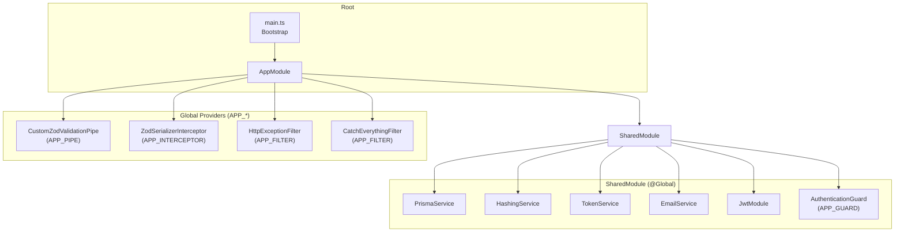
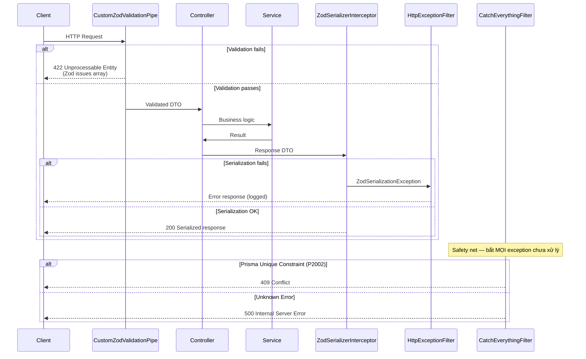
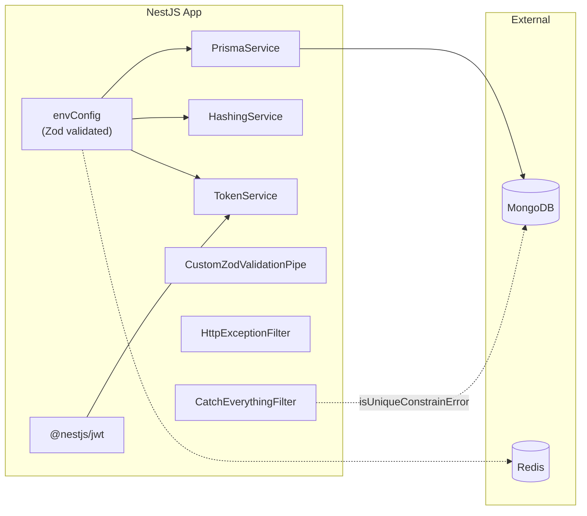

# 🏗️ Kiến trúc hệ thống — Mangaka Backend

> Tài liệu mô tả kiến trúc tổng thể, data flow, và các design pattern được áp dụng trong dự án.
> **Đọc file này TRƯỚC khi bắt tay vào code.**

---

## 1. Tech Stack Overview

| Layer | Công nghệ | Version | Ghi chú |
|-------|-----------|---------|---------|
| **Runtime** | Node.js | 22+ | LTS, chạy trên ES2022 target |
| **Framework** | NestJS | 11.x | Sử dụng module pattern, Dependency Injection |
| **Language** | TypeScript | 5.7+ | Strict mode, `NodeNext` module system |
| **ORM** | Prisma | 6.19+ | Schema-first, type-safe database access |
| **Database** | MongoDB | 7.x | Replica set (`rs0`) bắt buộc cho Prisma |
| **Cache/Queue** | Redis | 7.x | Caching, session, và job queue |
| **Validation** | Zod + nestjs-zod | zod 4.x | Schema validation cho cả request và response |
| **Auth** | JWT (HS256) | @nestjs/jwt 11.x | Access + Refresh token pair |
| **Hashing** | bcrypt | 6.x | Password hashing |
| **API Docs** | Swagger | @nestjs/swagger 11.x | Auto-generated tại `/api` |
| **Package Manager** | pnpm | 10+ | Workspace-aware, lockfile `pnpm-lock.yaml` |
| **Container** | Docker | Multi-stage build | Production (`Dockerfile`) + Dev all-in-one (`Dockerfile.dev`) |
| **CI** | GitHub Actions | - | Build verification trên `main` và `develop` |
| **Linting** | ESLint + Prettier | Flat config (`eslint.config.mjs`) | No semicolons, single quotes, 120 printWidth |

---

## 2. Cấu trúc thư mục

```
BE-dev/
├── prisma/
│   └── schema.prisma              # Database schema (MongoDB)
├── src/
│   ├── main.ts                     # Bootstrap — khởi tạo app, Swagger, listen port
│   ├── app.module.ts               # Root module — import SharedModule + feature modules, đăng ký global pipes/filters/interceptor
│   ├── initialScript/              # Seed script (admin, roles) — chạy bằng `pnpm seed`
│   ├── modules/                    # ⭐ Feature modules (vertical slice)
│   │   └── auth/                   # Module mẫu: controller + services/ + repo + schemas + dto + errors
│   └── shared/                     # ⭐ Shared module — core infrastructure, @Global()
│       ├── shared.module.ts        # Export Prisma/Hashing/Token/Email + đăng ký AuthenticationGuard (APP_GUARD)
│       ├── config/
│       │   └── envConfig.ts        # Zod-validated env variables (fail-fast startup)
│       ├── constant/               # auth.constant.ts, role.constant.ts (KHÔNG hard-code messages)
│       ├── decorators/             # active-user.decorator.ts, auth.decorator.ts (@IsPublic, @ActiveUser)
│       ├── dto/                    # request.dto.ts, response.dto.ts (shared DTOs, vd MessageResDto)
│       ├── emails/                 # React-email templates (.tsx)
│       ├── filters/
│       │   ├── http-exception.filter.ts      # Catch HttpException — log ZodSerializationException
│       │   └── catch-everything.filter.ts    # Catch ALL — safety net, handle Prisma unique constraint
│       ├── guards/
│       │   ├── authentication.guard.ts       # Global guard — phân nhánh theo authType (Bearer/None)
│       │   └── access-token.guard.ts         # Verify JWT access token
│       ├── helpers/
│       │   ├── helper.prisma.ts    # Type guards cho Prisma errors (P2002, P2025)
│       │   └── helperOtp.ts        # Generate 6-digit OTP
│       ├── models/                 # Shared entity schemas (shared-user.model.ts, ...)
│       ├── pipes/
│       │   └── custom-zod-validation.pipe.ts # 422 thay vì 400 cho validation errors
│       ├── services/
│       │   ├── prisma.service.ts   # PrismaClient wrapper — lifecycle hooks
│       │   ├── hashing.service.ts  # bcrypt hash/compare
│       │   ├── token.service.ts    # JWT sign/verify (access + refresh)
│       │   └── email.service.tsx   # Gửi email qua Resend (render React-email)
│       └── types/
│           └── jwt.type.ts         # JwtAccessTokenPayload / JwtRefreshTokenPayload
├── test/                           # E2E tests (Jest)
├── .env                            # Env variables (KHÔNG commit lên git)
├── .env.example                    # Template env
├── docker-compose.yml              # Dev one-click: MongoDB + NestJS (cho FE devs)
├── Dockerfile                      # Production multi-stage build
├── Dockerfile.dev                  # Dev image (Node + MongoDB cùng container)
├── docker-entrypoint.dev.sh        # Init script: MongoDB replica → pnpm install → prisma → NestJS
├── .github/workflows/ci.yml        # CI: build Docker image verification
├── package.json                    # Dependencies + scripts
├── pnpm-lock.yaml                  # Lockfile
├── pnpm-workspace.yaml             # pnpm build allowlist (native modules)
├── tsconfig.json                   # TS config — strict, NodeNext modules
├── eslint.config.mjs               # ESLint flat config
└── .prettierrc                     # Code formatting rules
```

---

## 3. Module Architecture



### SharedModule là `@Global()`
- Tất cả services exported (PrismaService, HashingService, TokenService, EmailService) đều **tự động available** ở mọi module khác mà KHÔNG cần import lại.
- Khi tạo module mới, chỉ cần inject service qua constructor là dùng được.
- `SharedModule` còn đăng ký **`AuthenticationGuard` làm global guard** (`APP_GUARD`) → mọi route mặc định yêu cầu Bearer token, trừ khi gắn `@IsPublic()`.

> ⚠️ **Chưa có tầng Authorization (RBAC).** Guard hiện tại chỉ xác thực (authentication), chưa phân quyền theo `Role`. Khi thêm endpoint nhạy cảm (board vote, payment, duyệt chapter) cần bổ sung `RolesGuard` + `@Roles()` chạy sau `AuthenticationGuard`.

---

## 4. Request Lifecycle & Error Handling



### Chi tiết Error Flow

| Thứ tự ưu tiên | Filter | Bắt gì | Response |
|----------------|--------|--------|----------|
| 1 | `CustomZodValidationPipe` | Zod validation errors | **422** — mảng `{code, message, path}` |
| 2 | `HttpExceptionFilter` | Mọi `HttpException` | Log `ZodSerializationException`, rồi xử lý mặc định |
| 3 | `CatchEverythingFilter` | **Mọi thứ còn lại** | Prisma P2002 → **409**, còn lại → **500** |

> ⚠️ **Quan trọng**: Validation errors trả về **422** (KHÔNG phải 400). Đây là design decision có chủ đích để client phân biệt validation error vs bad request.

---

## 5. Env Configuration — Fail-Fast Strategy

File `envConfig.ts` sử dụng Zod để validate toàn bộ biến môi trường **ngay khi app khởi động**:

```typescript
// Nếu thiếu hoặc sai kiểu bất kỳ env var nào → process.exit(1) ngay lập tức
const configSchema = z.object({
  PORT: z.coerce.number(),
  SALT_OR_ROUNDS: z.coerce.number(),
  DATABASE_URL: z.string(),
  ACCESS_TOKEN_SECRET: z.string(),
  REFRESH_TOKEN_SECRET: z.string(),
  // ... tất cả các biến bắt buộc
})
```

### Danh sách env variables

| Variable | Type | Mô tả |
|----------|------|--------|
| `PORT` | number | Port server listen |
| `SALT_OR_ROUNDS` | number | bcrypt salt rounds |
| `DATABASE_URL` | string | MongoDB connection string (cần replica set) |
| `REDIS_URL` | string | Redis connection string |
| `ACCESS_TOKEN_SECRET` | string | Secret key cho access JWT |
| `REFRESH_TOKEN_SECRET` | string | Secret key cho refresh JWT |
| `ACCESS_TOKEN_EXPIRES_IN` | string | TTL access token (vd: `1h`) |
| `REFRESH_TOKEN_EXPIRES_IN` | string | TTL refresh token (vd: `7d`) |
| `API_KEY` | string | API key cho internal services |
| `AUTH_TYPE_KEY` | string | Header key chỉ định loại auth (default: `authType`) |
| `ADMIN_NAME` | string | Seed admin name |
| `ADMIN_PASSWORD` | string | Seed admin password |
| `ADMIN_EMAIL` | string | Seed admin email |
| `ADMIN_PHONE` | string | Seed admin phone |
| `OTP_EXPIRES_IN` | string | TTL mã OTP (vd: `5m`) |

> **Lưu ý**: Khi chạy production (`NODE_ENV=production`), không cần file `.env` vật lý — env vars được inject từ orchestrator.

---

## 6. Database Layer

### Prisma + MongoDB

- **Provider**: `mongodb`
- **Schema location**: `prisma/schema.prisma`
- **ID strategy**: `@default(auto()) @map("_id") @db.ObjectId` — sử dụng ObjectId gốc của MongoDB
- **Replica Set**: Bắt buộc (`rs0`) — Prisma yêu cầu transactions/change streams

### Models

Schema (`prisma/schema.prisma`) đã khai báo trước **toàn bộ domain Mangaka** (~35 models) dù mới có module `auth`. Nhóm theo bounded context:

| Nhóm | Models |
|------|--------|
| **Identity & Access** | `User`, `Role`, `RefreshToken`, `OtpRequest` |
| **Content & Production** | `Series`, `SeriesProposal`, `Name`, `NamePage`, `Chapter`, `Page`, `Region`, `Manuscript`, `Asset`, `TaskAsset` |
| **Tasks & Review** | `Task`, `TaskVersion`, `Annotation`, `Schedule`, `ScheduleExtension` |
| **Survey & Ranking** | `SurveyPeriod`, `SurveyData`, `SurveyEntry`, `ReaderVote`, `ReaderVoteSeries`, `RankingRecord` |
| **Board & Decisions** | `BoardDecision`, `Vote`, `SeriesReport`, `ReportAttachment` |
| **Finance** | `PaymentConfig`, `EarningRecord` |
| **Notification & Config** | `Notification`, `VotingConfig`, `BoardConfig` |

**Enum hiện có**: `UserStatus`, `OtpPurpose`. Còn lại nhiều trường `status`/`result`/`reviewStatus` đang để kiểu `String` tự do — nên chuyển dần sang Prisma enum cho các state machine (Series/Task/Chapter/BoardDecision...) để type-safe.

```prisma
model User {
  id            String     @id @default(auto()) @map("_id") @db.ObjectId
  email         String     @unique
  name          String
  displayName   String?
  password      String
  phoneNumber   String
  avatar        String?
  roleId        String     @db.ObjectId
  status        UserStatus @default(INACTIVE)
  emailVerified Boolean    @default(false)
  createdAt     DateTime   @default(now())
  updatedAt     DateTime   @updatedAt
  deletedAt     DateTime?

  role          Role           @relation(fields: [roleId], references: [id])
  refreshTokens RefreshToken[]

  @@index([deletedAt])
}
```

### PrismaService Lifecycle

```
App Start → onModuleInit() → $connect()
App Stop  → onModuleDestroy() → $disconnect()
```

### Prisma Error Helpers

| Function | Prisma Code | Ý nghĩa |
|----------|-------------|---------|
| `isUniqueConstrainError()` | P2002 | Duplicate key / unique constraint violation |
| `isNotFoundError()` | P2025 | Record not found |

---

## 7. Authentication Architecture

### JWT Token Pair

```
┌─────────────────────────────────────────────────┐
│ TokenService                                     │
├─────────────────────────────────────────────────┤
│ signAccessToken(userId)  → JWT (HS256, 1h TTL)  │
│ signRefreshToken(userId) → JWT (HS256, 7d TTL)  │
│ verifyAccessToken(token) → JwtPayload           │
│ verifyRefreshToken(token)→ JwtPayload           │
└─────────────────────────────────────────────────┘
```

### JWT Payload Interfaces

Access token mang theo `roleName` để chuẩn bị cho RBAC; refresh token chỉ mang `userId`.

```typescript
interface JwtAccessTokenPayload {
  userId: string   // ID người dùng (Mongo ObjectId dạng string)
  roleName: string // Role code — dùng cho phân quyền
  exp: number      // Expiration timestamp
  iat: number      // Issued at timestamp
}

interface JwtRefreshTokenPayload {
  userId: string
  exp: number
  iat: number
}
```

### HashingService

- `hash(value)` — bcrypt hash với salt rounds từ env
- `compare(value, hash)` — so sánh plaintext với hash

---

## 8. Docker Architecture

### Production (Dockerfile)

```
Multi-stage build:
  Stage 1 (base)    → Node 22-slim + openssl + corepack
  Stage 2 (build)   → pnpm install → prisma generate → nest build
  Stage 3 (runtime) → Copy dist + node_modules → non-root user → CMD node dist/main.js
```

### Development (docker-compose.yml + Dockerfile.dev)

```
Single container "all-in-one":
  1. Start MongoDB 7 (replica set rs0)
  2. Start Redis 7
  3. pnpm install
  4. prisma generate
  5. prisma db push
  6. nest start --watch (hot reload)
```

> Docker dev setup dành cho **FE devs** — không cần cài Node/pnpm/MongoDB trên máy.

---

## 9. CI/CD

### GitHub Actions (`ci.yml`)

- **Trigger**: Push lên `main`/`develop` hoặc bất kỳ Pull Request
- **Job**: Build Docker image (production `Dockerfile`) — không push, chỉ verify build thành công
- **Cache**: GitHub Actions cache (`type=gha`) cho Docker layers

---

## 10. Code Style & Conventions

### Prettier Rules

| Rule | Value |
|------|-------|
| Quotes | Single (`'`) |
| Semicolons | **Không dùng** |
| Trailing comma | All |
| Print width | 120 |
| Tab width | 2 (spaces) |
| Arrow parens | Always |

### ESLint Rules

- TypeScript-ESLint recommended (type-checked)
- `no-explicit-any`: **OFF** (cho phép dùng `any`)
- `no-floating-promises`: **WARN**
- `no-unsafe-argument`: **WARN**
- `no-unsafe-assignment`: **WARN**

### TypeScript Config

- Module: `NodeNext` (ESM-style imports)
- Target: `ES2022`
- Strict mode: **ON**
- `noImplicitAny`: **OFF** (cho phép implicit any)
- Decorators: Experimental enabled
- Path alias: `src/*` → `./src/*`

---

## 11. Dependency Graph



---

## 12. Các Scripts quan trọng

| Script | Lệnh | Mô tả |
|--------|-------|--------|
| `prisma:generate` | `prisma generate` | Tạo lại Prisma Client (chạy sau khi sửa `schema.prisma`) |
| `start:dev` | `nest start --watch` | Dev mode với hot reload |
| `start:prod` | `node dist/main` | Production mode |
| `build` | `nest build` | Compile TypeScript → `dist/` |
| `lint` | `eslint ... --fix` | Lint + auto-fix |
| `test` | `jest` | Unit tests |
| `test:e2e` | `jest --config ./test/jest-e2e.json` | End-to-end tests |
